# Manual Tecnico
La Facultad de Ingeniería de la Universidad de San Carlos de Guatemala necesita una solución para almacenar archivos importantes y está considerando crear su propio sistema. Este sistema debe ser compatible con cualquier sistema operativo y se plantea la posibilidad de usar Github Pages para crear un sitio web. La funcionalidad del sistema debe ser similar a Google Drive, con la característica de que la Universidad de San Carlos sea la propietaria. Además, el sistema debe incluir características específicas de la aplicación. Como estudiante de ingeniería en sistemas, se me ha solicitado desarrollar una aplicación llamada EDD GoDrive para la gestión de archivos. Este sistema debe permitir el control de usuarios, con espacios de almacenamiento para cada uno de los cursos de la carrera de ingeniería en sistemas, donde los usuarios puedan subir, crear y eliminar carpetas y archivos, así como modificar los nombres de las carpetas y archivos existentes. La aplicación debe ser responsiva y fácil de usar para los usuarios.

## Conocimientos

 - Desarrollo web
 - Estructuras de datos
 - JavaScript
 - JSON(JavaScript Object Notation)

## Requisitos
Para realizar un correcto uso de este software es necesario el uso de un navegador ya sea 

- Chrome

- Firefox

- Edge

es necesario que esten actualizados a las ultimas versiones ya que se utilizan recursos web propios de versiones actuales

## Estructuras
Las estructuras de datos son fundamentales en el desarrollo de páginas web, ya que permiten organizar y gestionar la información de manera eficiente y efectiva. En el contexto de una página web, las estructuras de datos son utilizadas para representar y almacenar datos como texto, imágenes, videos, formularios y más. Por ejemplo, los elementos HTML, CSS y JavaScript utilizados en una página web son esencialmente estructuras de datos que definen la estructura, presentación y comportamiento de una página. Además, las estructuras de datos son esenciales en la manipulación de datos en el lado del servidor, como bases de datos y APIs, para almacenar y recuperar información de manera eficiente. El uso adecuado de estructuras de datos en el desarrollo de páginas web permite una navegación más rápida, una mejor organización de la información y una experiencia del usuario más amigable y satisfactoria.

- Lista Circular: es una estructura de datos en la que los nodos están conectados en forma circular, de modo que el último nodo apunta al primer nodo, formando un bucle. Esto permite recorrer la lista de forma continua, sin tener un final definido, lo que puede ser útil en ciertas aplicaciones donde se requiere un acceso circular a los elementos de la lista.
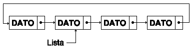
- Matriz Dispersa: estructura de datos utilizada para representar matrices que contienen principalmente elementos nulos o vacíos. En lugar de almacenar todos los elementos de la matriz en una estructura bidimensional, solo se almacenan los elementos no nulos junto con sus posiciones en la matriz. Esto permite ahorrar espacio en memoria y mejorar la eficiencia en la manipulación de matrices grandes con muchos elementos nulos.
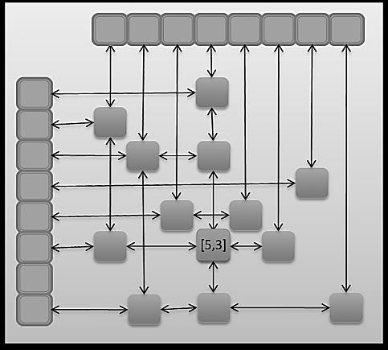
- Arbol Multicamino: es un tipo de árbol binario de búsqueda equilibrado, en el que se asegura que la diferencia de altura entre los subárboles izquierdo y derecho de cada nodo sea como máximo 1. Esto garantiza un tiempo de búsqueda, inserción y eliminación de elementos en el árbol de manera eficiente y equilibrada, evitando el peor caso de desequilibrio que podría ocurrir en otros tipos de árboles.

- Arbol Avl: es una estructura de datos en la que cada nodo puede tener más de dos hijos, a diferencia de los árboles binarios que solo tienen dos hijos. Esto permite una mayor flexibilidad en la representación y organización de datos jerárquicos, y puede ser útil en aplicaciones donde se necesita un mayor grado de descomposición o partición de los datos en múltiples caminos. Los árboles multicamino son utilizados en diversas aplicaciones como sistemas de archivos, bases de datos, y representaciones de grafos, entre otros.
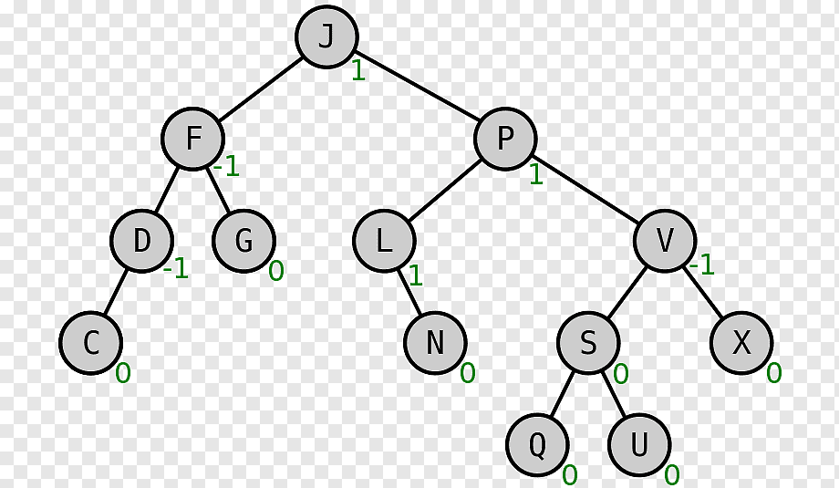

## Github Pages
GitHub Pages es un servicio de alojamiento gratuito proporcionado por GitHub, que permite a los usuarios crear y publicar sitios web estáticos directamente desde sus repositorios de GitHub. Es una forma sencilla y conveniente de alojar páginas web para proyectos de código abierto, documentación de proyectos, blogs personales y otros fines.

## Diagrama de Clases

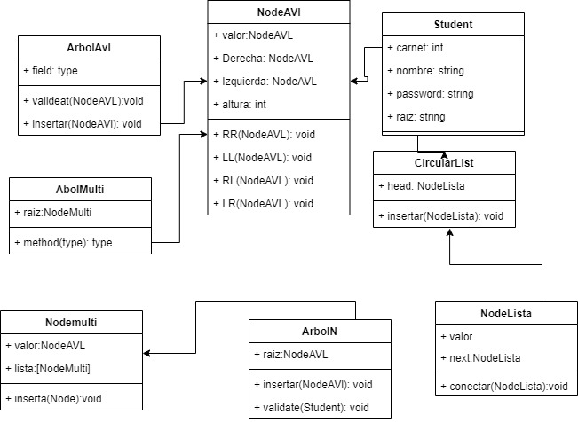

# Manual de Usuario

## Login

nos logeamos con las credenciaales de administrador user:admin password:admin 

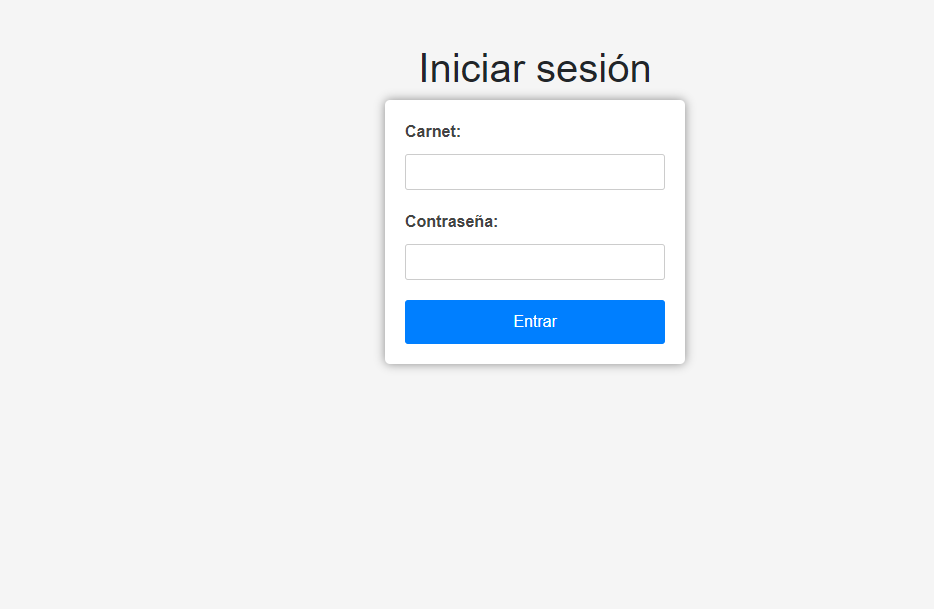

## admin dashboard

en este apartado tenemos Carga Masiva, el reporte del arbol y la muestra de los usuarios inorden,posorden y preorden en una tabla

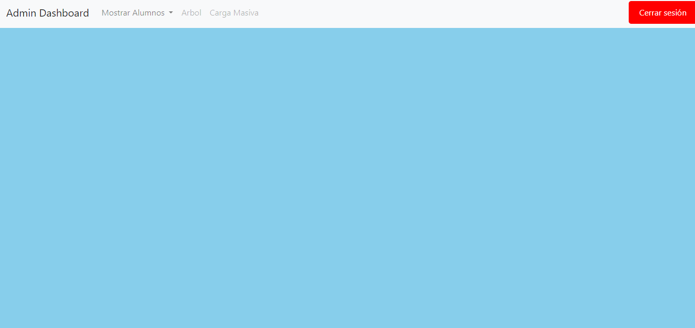

### Carga Masiva
Tenemos que elegir un archivo json que servira como entrada de nusetra pagina web

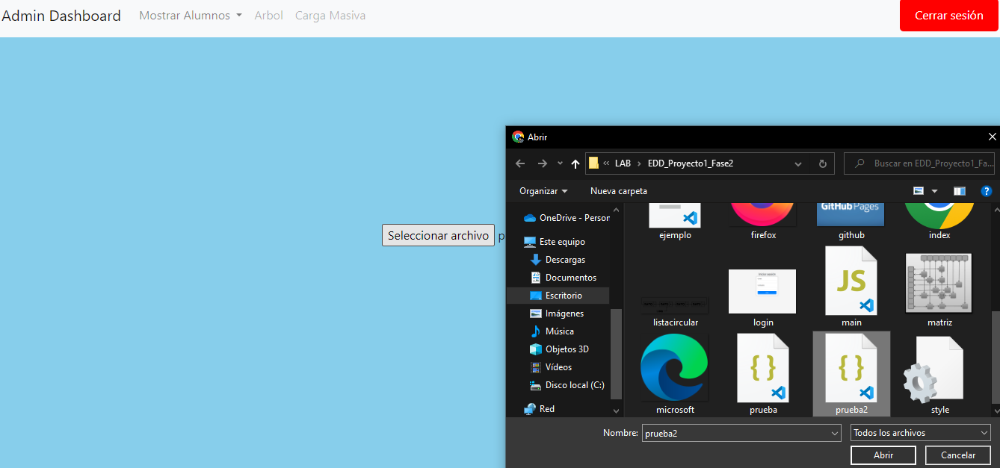

### Reporte arbol AVL

se genera un reporte en grahviz sobre la estructura de datos de arbol avl donde se almacenaron todos los usuarios

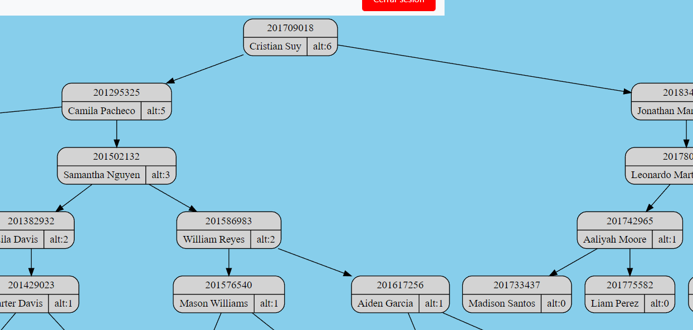

### Mostrar

se despliega una tabla que muestra el carnet y el nombre de todos los estudiantes subidos al sistema en el orden correspondiente

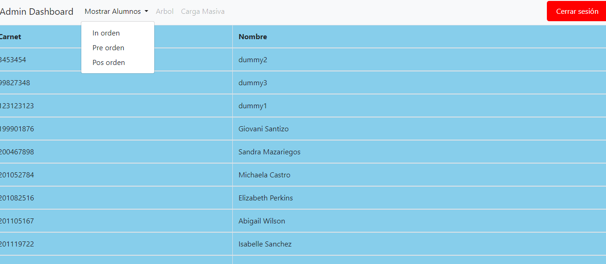

## user dashboard

tenemos el panel de usuario que cuenta con diversas funcionalidades entre ellas crear carpetas y archivos asi como su eliminacion 

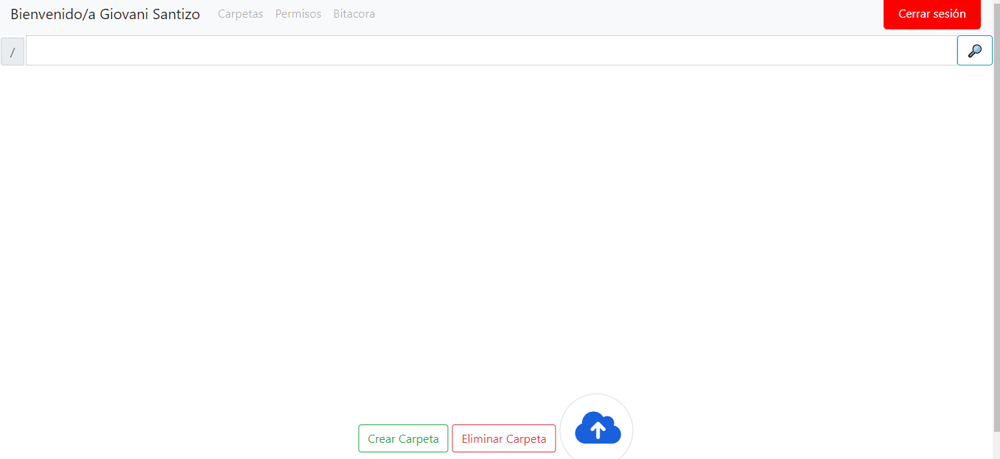

## crear carpeta
debemos ingresar la ruta donde queramos crear la carpeta 

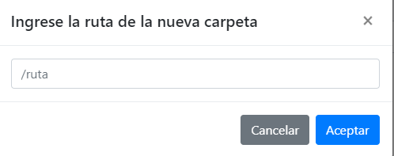

## subir archivo
permite subir 3 tipos de archivos pdf,txt e imagenes
todos los archivos son guardados en base 64

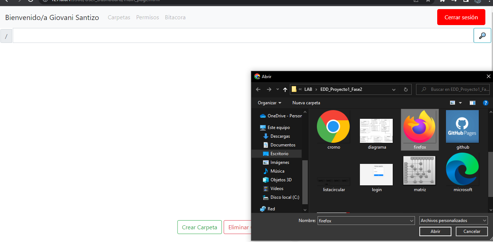

## eliminar carpeta
eliminamos la ruta actual en la que estamos borra tanto carpetas como archivos por lo que se muestra un aviso 

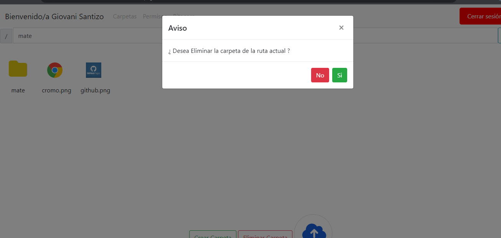

## buscar

muestra todos los archivos y carpetas de la ruta actual las imagenes una pequeña pre-visualizacion y los demas archivos como iconos

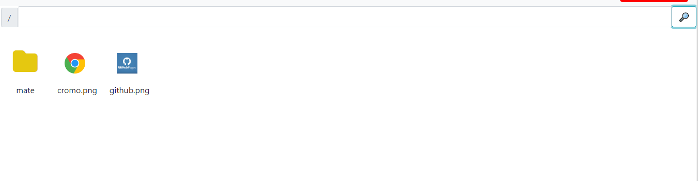
## Autor

- [@walterjav19](https://www.github.com/walterjav19)

